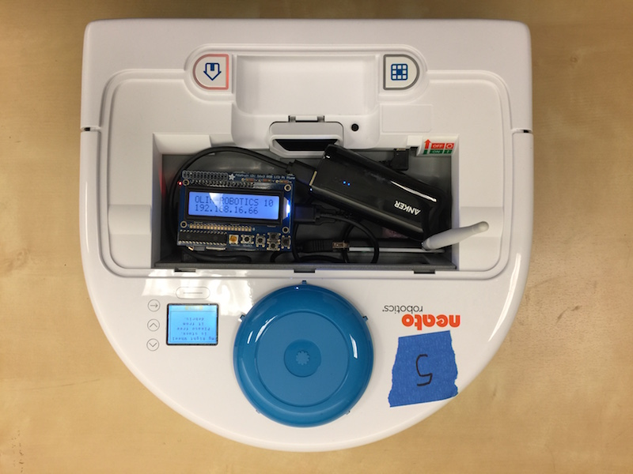

# Introduction to Computational Robotics: Warmup Project
By: Zaraius Bilimoria, Dhvan Shah

### Overview:
This project serves as an introduction to robotics programming using the Robot Operating System (ROS2) with a Neato vacuum robot. The goal was to implement a finite-state machine (FSM) to control the Neato, enabling it to sequence through several distinct autonomous behaviors. We successfully implemented a full routine: exploring in an expanding spiral, finding and following a wall, navigating a corner, and then searching for and following a person. An overarching emergency stop (E-stop) state ensures safe operation.

The architecture is modular, with a central state machine node controlling the transitions while dedicated behavior nodes handle the control logic for each specific task.



### How to run 
First, ensure you are in your ROS2 workspace(if you are using Docker, make sure you are inside your container). Build the package and source the environment with the following command:
```bash
cd ~/ros2_ws
colcon build --symlink-install --packages-select robo_behaviors_fsm
source ~/ros2_ws/install/setup.bash
```

Then, you can launch the finite-state machine and all associated behavior nodes using our launch file:

```ros2 launch robo_behaviors_fsm launch.py```

### Finite State Machine Design
The overall mission for our robot is to explore until it finds a wall, follow the wall until it reaches a corner, execute a turn, drive straight to find a person, and then begin following that person. 


States and Transitions
Our FSM consists of seven distinct states defined in our State enum:
1. IDLE: The initial state where the robot is stationary.

2. CIRCLE: The robot drives in an expanding clockwise spiral to explore.

3. WALL_FOLLOW: The robot follows a wall on its right side at a fixed distance.

4. TURN: An open-loop behavior to execute a fixed-angle turn at a corner.

5. STRAIGHT: The robot drives straight forward, searching for a person.

6. PERSON_FOLLOW: The robot identifies and follows the closest detected object.

7. ESTOP: A terminal state where the robot immediately stops all movement.

Transitions are managed by the central state_machine_node, which listens to boolean flag topic published by the behaviors nodes.
 - IDLE --> CIRCLE: Occurs automatically upon startup(in the future could wait for an initialize command)
 - CIRCLE --> WALL_FOLLOW: Triggers when /wall_found topic publishes True
 - WALL_FOLLOW -> TURN:  when the /wall_end topic publishes True, indicating a corner has been detected. 
 - TURN -> STRAIGHT:  Occurs after the robot completes its pre-programmed 135-degree turn.
 - STRAIGHT -> PERSON_FOLLOW: Triggers when the /found_person topic publishes True.
 - (Any State) -> ESTOP: Triggers immediately if the /estop topic publishes True (e.g., from a bumper collision).

#### Implemented Behaviors
Each major behavior is encapsulated in its own ROS2 node. This modular design allows for independent testing and clear separation of concerns.

##### Circle (Exploration)
 - Node: drive_circle_node.py

 - Goal: To have the robot explore its surroundings to find a boundary wall.

 - Strategy: The robot drives in a clockwise spiral with a constantly increasing radius. The linear velocity v is constant, while the angular velocity ω is calculated as ω=v/r, where the radius r grows over time. This ensures efficient and expanding coverage of the area.

##### Wall Following
 - Node: wall_following_node.py

 - Goal: To drive forward while maintaining a constant distance to a wall.
 - Assumptions: A key assumption is that the wall will be on the robot's right side. This is a safe assumption because the preceding CIRCLE state moves in a clockwise spiral, naturally placing the robot's right side toward any discovered boundary.

 - Control Strategy: We implemented a proportional controller that adjusts only the robot's angular velocity to keep its linear speed constant. The control logic is based on two error terms calculated from the LIDAR scan:
    - Distance Error: The difference between the target distance and the measured distance from a point directly to the robot's right (a scan at -90°).
    - Angle Error: The angle of the wall relative to the robot's frame. This is calculated by taking two LIDAR points (at -90° and -135°) and finding the angle of the line between them using atan2(). An angle of zero means the robot is perfectly parallel to the wall.
The final angular velocity command is a simple weighted sum of these two errors.

 - Corner Detection: This node also determines when a wall ends (i.e., a corner is reached). It does this by checking for a close obstacle in the robot's forward path after it has been following the wall for a minimum duration. It then publishes True to the /wall_end topic.


##### Corner Navigation (Self-Designed Behavior)
This behavior is our own unique addition and is handled directly by the state_machine_node. It combines two states, TURN and STRAIGHT, to navigate corners.

 - Goal: To successfully turn a corner after wall-following and then proceed forward.

 - TURN State Strategy: This is an open-loop maneuver. Upon entering this state, the robot executes a timed turn at a constant angular velocity to achieve a rotation of approximately 135 degrees. This positions it to move into the new open space.

 - STRAIGHT State Strategy: After turning, the robot drives straight forward. During this phase, the person_following_node is actively scanning for a target.

##### Person Following
 - Node: person_following_node.py

 - Goal: To identify and follow a nearby person or object.
 - Assumptions: To simplify the problem, we assume that the closest object detected by the LIDAR is the target we want to follow. This works well in uncluttered environments.
 - Control Strategy: This node uses two independent proportional controllers—one for linear velocity and one for angular velocity.

    - It first finds the closest point in the LIDAR scan to identify the target.

    - An angular controller adjusts the robot's rotation to face the target directly.

    - A linear controller adjusts the robot's forward speed to maintain a fixed distance from the target.

    - A key refinement is that the robot will stop moving forward if the angle error is large, allowing it to turn in place to face the target before proceeding. This creates more stable following behavior.


### System Architecture & Code Structure
Our design emphasizes decentralization and clear communication channels via ROS2 topics.

 - state_machine_node.py: The "brain" of the FSM. It is the sole authority on the robot's current state. It subscribes to boolean flag topics (/wall_found, /wall_end, /found_person, /estop) and publishes the active state to /current_state. It also directly handles the /cmd_vel publishing for the TURN and STRAIGHT states.

 - Behavior Nodes (drive_circle.py, wall_follower.py, person_follower.py): These act as "behavior servers." They all subscribe to /current_state. Each node only executes its logic and publishes to /cmd_vel when its corresponding state is active.

 - Sensor Processing Nodes: The wall_follower and person_follower nodes also process /stable_scan data to produce higher-level information, which they publish as boolean flags for the state machine to use. This decouples complex sensor processing from the state transition logic.


### Project Reflection
##### Challenges:
 - Tuning Controller Hyperparameters: A significant amount of time was dedicated to tuning the proportional gains (p) and distance setpoints for the wall-following and person-following behaviors. Finding the right balance was critical; gains that were too high caused unstable oscillations, while gains that were too low resulted in a sluggish and unresponsive robot. This process of iterative, manual tuning highlighted the sensitivity of control systems.

 - Debugging in a Distributed System: The nature of ROS2, with multiple nodes running concurrently, introduced unique debugging challenges. We encountered issues ranging from simple mistakes like forgetting to build and source the workspace, to more complex problems. In one instance, the simulated robot behaved erratically because a second, hidden Docker container was also publishing to the /cmd_vel topic. This taught us the importance of verifying the entire system state when debugging, as the issue isn't always in the code you're looking at.
 ##### Future Improvements:
 - More Robust State Transitions: The current transition logic, particularly for corner detection, relies on a simple timer heuristic (waiting five seconds before checking for a forward obstacle). We would improve this by implementing more robust, sensor-driven logic that analyzes the geometry of the LIDAR scan to detect corners directly, making the transition more immediate and reliable.
 - Ambidextrous Wall Following: For simplicity, our algorithm strictly follows walls on the robot's right side. A major improvement would be to make the behavior more flexible, allowing the robot to detect and choose to follow a wall on either its left or right side, making it far more adaptable to arbitrary environments.
 - Sim-to-Real Deployment: All of our development and testing has been conducted in the Gazebo simulator. The ultimate goal is to bridge the sim-to-real gap by deploying and testing our code on the physical Neato robot. This would involve addressing real-world challenges like sensor noise, battery limitations, and unpredictable environmental factors.

##### Key Takeaways
 - Modularity is the Key to Managing Complexity: Our most important takeaway was the power of separating the FSM logic from the individual behavior nodes. By first defining the states, transitions, and communication interfaces (the ROS2 topics) together, we were able to split the work and develop the behavior nodes in parallel. This decoupled architecture made the entire system much easier to build, test, and debug.
 - The Power of the Publish/Subscribe Model: This project demonstrated the power of the ROS2 framework. The publish/subscribe communication model allowed our nodes to operate independently without direct knowledge of one another, making the system incredibly scalable and modular. A behavior node doesn't need to know who sets the state; it only needs to listen to the /current_state topic. This is the principle that makes complex robotics systems manageable.